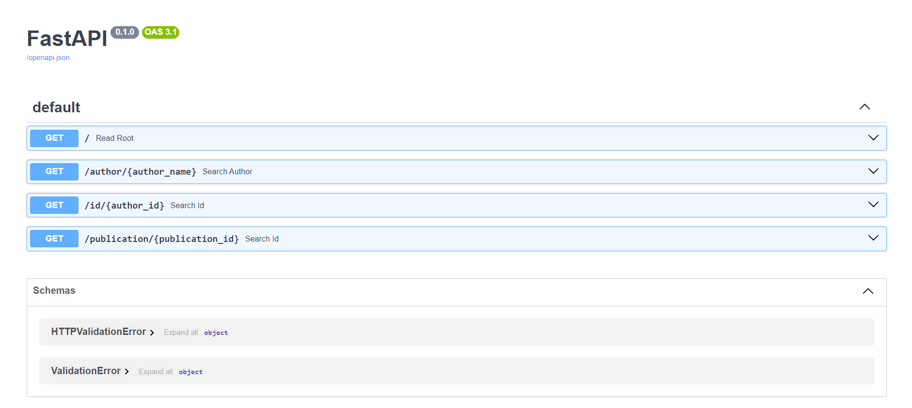

# Flask-LLM App

## Table of Contents

- [Update](#update)
- [Introduction](#introduction)
- [Installation](#installation)
- [Usage](#usage)
- [Problem of the current application](#problem-of-the-current-application)
- [Liscence](#liscence)
- [Contributors](#contributors)

## Update

[on 2023-10-17] Instruction on the use of Fastapi App\
Go to the folder `cd OpenAlex\fastapi`\
Create a vitual environment and install the dependencies and activate the environment:

```bash
python -m venv venv
Scripts\activate
pip install -r requirements.txt
```

After correctly installed and activate the environment, run the fastapi server:

```bash
uvicorn main:app --reload
```

Now you can explore the api at `http://127.0.0.1:8000/docs`. Currently, the app supports search author by name and getting n levels of coauthors.



In order for the graph construction function to work properly, you can create a neo4j instance on neo4j web, and put the configurations such as username, password, and uri in a `.env` file. The `.env` file should be in the same directory as `main.py`. You can check the format of the `.env` file in `.env.example` as well. After running the neo4j instance, the application should be working properly.

## Introduction

This is a flask app that uses the LLM model to extract chemicals from a PDF File input.

## Installation

1. Clone the repository: `git clone https://github.com/wesharetechnology/flask-llm-pdf-analyzer.git`

2. The project runs on conda environment for running large language models. To install the same conda environment, run `conda env create -f llm_env.yml`

3. Activate the conda environment: `conda activate llm_env`

### Build a flask app

Tutorial Source: [How to build a web application using Flask and deploy it to the cloud](https://www.freecodecamp.org/news/how-to-build-a-web-application-using-flask-and-deploy-it-to-the-cloud-3551c985e492/)

1. Activate the environment by `Scripts\activate`

- If you are using PowerShell, you might need to set the execution policy to unrestricted. Run the following command in PowerShell as Administrator: `Set-ExecutionPolicy -ExecutionPolicy Unrestricted -Scope CurrentUser`

2. Make sure flask is installed: `pip install -r pip_requirements.txt`

### Run the llm model (ChatGLM-6B)

1. Make sure the correct python version/interpreter is used when typing `python` in terminal
2. Currently, the model is run locally. The path is set at `main.py` in `LLM_MODEL_PATH`. Change the path to the correct path of the model. or change to `THUDM\chatglm-6b` to use the online model on huggingface

## Usage

1. Go to the directory `cd flask-llm-pdf-analyzer`
2. Run `python main.py`

### Demo of Usage


## Problem of the current application

1. [Scalability] Locks and the multithread handler have not been implemented
2. [Error Rate] The llm gives unstable output
    - Results are not complete: some chemicals are missing
    - The output is not consistent: the same input may give different output
    - The output is not accurate: some chemicals that appear in the article are not used in the laboratory
    - The model can output mixed Chinese and English; This app cannot output JSON
3. [Response Time] Currently, each sentence is processed one by one, which is not efficient
    - There is a tradeoff: short sentences and short prompts lead to more accurate result, the model is called more times, hence slower response time; long sentences and long prompts lead to less accurate result, the model is called less times, and the response time is shorter

## Licence

ChatGLM-6B license: [here](https://github.com/THUDM/ChatGLM-6B/blob/main/MODEL_LICENSE)\
Cite the article

```
@article{zeng2022glm,
  title={Glm-130b: An open bilingual pre-trained model},
  author={Zeng, Aohan and Liu, Xiao and Du, Zhengxiao and Wang, Zihan and Lai, Hanyu and Ding, Ming and Yang, Zhuoyi and Xu, Yifan and Zheng, Wendi and Xia, Xiao and others},
  journal={arXiv preprint arXiv:2210.02414},
  year={2022}
}
```

## Contributors

Contributor: [Wang Yumeng](https://github.com/Alexwwwwww)
