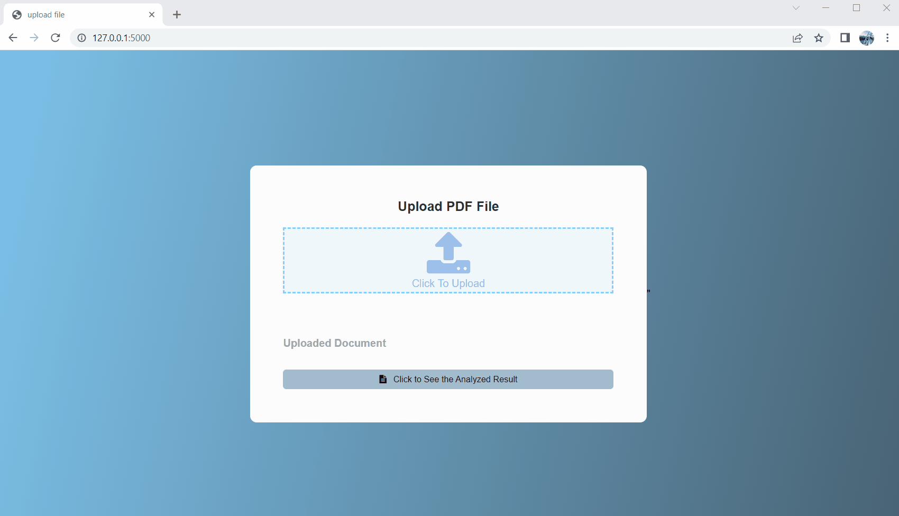

# Flask-LLM App
## Table of Contents
- [Introduction](#introduction)
- [Installation](#installation)
- [Usage](#usage)
- [Problem of the current application](#problem-of-the-current-application)
- [Liscense](#liscence)
- [Contributors](#contributors)
## Introduction
This is a flask app that uses the LLM model to extract chemicals from a PDF File input.
## Installation
1. Clone the repository: `git clone https://github.com/wesharetechnology/flask-llm-pdf-analyzer.git`
2. The project runs on conda environment for running large language models. To install the same conda environment, run `conda env create -f llm_env.yml` and also `pip install -r pip_requirement.txt` (actually pip install or conda install?)
### Build a flask app
Tutorial Source: [How to build a web application using Flask and deploy it to the cloud](https://www.freecodecamp.org/news/how-to-build-a-web-application-using-flask-and-deploy-it-to-the-cloud-3551c985e492/)
1. On windows, allow running the script `Set-ExecutionPolicy -ExecutionPolicy Unrestricted -Scope CurrentUser`
2. On windows, `Scripts\activate`
3. Make sure flask is installed: `pip install flask`

### Run the llm model (ChatGLM-6B)
1. Make sure the correct python version/interpreter is used when typing `python` in terminal
2. Currently, the model is run locally. The path is set at `main.py` in `LLM_MODEL_PATH`. Change the path to the correct path of the model. or change to `THUDM\chatglm-6b` to use the online model on huggingface
## Usage
1. Go to the directory `cd flask-llm-pdf-analyzer`
2. Run `python main.py`
### Demo of Usage

## Problem of the current application
1. [Scalability] Locks and the multithread handler have not been implemented
2. [Error Rate] The llm gives unstable output
    - Results are not complete: some chemicals are missing
    - The output is not consistent: the same input may give different output
    - The output is not accurate: some chemicals that appear in the article are not used in the laboratory
    - The model can output mixed Chinese and English; This app cannot output JSON
3. [Response Time] Currently, each sentence is processed one by one, which is not efficient
    - There is a tradeoff: short sentences and short prompts lead to more accurate result, the model is called more times, hence slower response time; long sentences and long prompts lead to less accurate result, the model is called less times, and the response time is shorter
## Licence

## Contributors 
Contributor: [Wang Yumeng](https://github.com/Alexwwwwww)